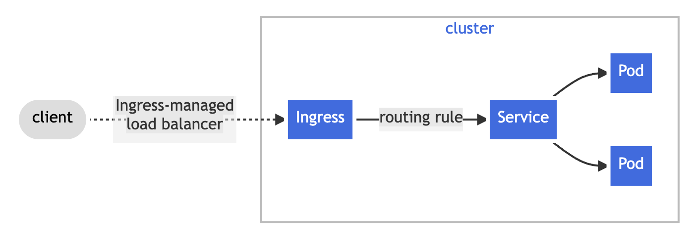

```
kind: Ingress
```

> Ingress exposes HTTP and HTTPS routes from outside the cluster to services within the cluster. Traffic routing is controlled by rules defined on the Ingress resource.




- Ingress는 임의의 포트나 프로토콜을 노출하지 않는다.
  - HTTP 및 HTTPS 이외의 서비스를 인터넷에 노출할 때는 NodePort, LoadBalancer Type 사용
- Ingress를 사용할 때는 Ingress Controller가 필요하다.
  - https://kubernetes.io/docs/concepts/services-networking/ingress-controllers/
  - 예제에서는 Nginx Ingress Controller 사용

```
helm upgrade --install ingress-nginx ingress-nginx \
  --repo https://kubernetes.github.io/ingress-nginx \
  --namespace ingress-nginx --create-namespace
```

이렇게 설치하면 `ingress-nginx` 네임스페이스가 생기게 되고, nginx ingress에 대한 Deployment, Pod, Service가 생성된다.

```
apiVersion: networking.k8s.io/v1
kind: Ingress
metadata:
  name: nginx-ingress
  namespace: ingress-nginx
spec: # ref. https://kubernetes.io/docs/reference/kubernetes-api/service-resources/ingress-v1/#IngressSpec
  ingressClassName: nginx
  rules:
    - host: test.my.local # 어떤 호스트를 받아서 처리할건지 (L7)
      http:
        paths:
          - path: /ping
            pathType: Prefix
            # pathType: Exact
            backend:
              service:
                name: external-ping
                port:
                  name: ping

          - path: /name
            pathType: Prefix
            backend:
              service:
                name: external-ping
                port:
                  number: 8080
```


---

ref. https://kubernetes.io/docs/concepts/services-networking/ingress/

