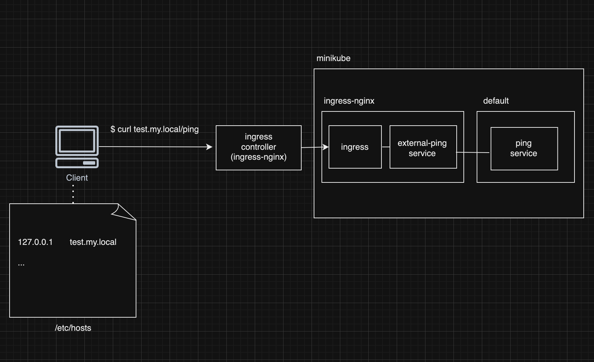

01번에서 ingress를 추가하여 도메인으로 접근할 수 있도록 설정한다.

```
apiVersion: v1
kind: Service
metadata:
  name: external-ping
  namespace: ingress-nginx # 얘를 alias로 하는
spec:
  type: ExternalName
  externalName: ping.default.svc.cluster.local # 기본적으로 쿠버네티스에서 사용하는것
```

```
apiVersion: networking.k8s.io/v1
kind: Ingress
metadata:
  name: nginx-ingress
  namespace: ingress-nginx
spec:
  ingressClassName: nginx
  rules:
    - host: test.my.local # 어떤 호스트를 받아서 처리할건지 (L7)
      http:
        paths:
          - path: /ping
            pathType: Prefix
            backend:
              service:
                name: external-ping
                port:
                  name: ping

          - path: /name
            pathType: Prefix
            backend:
              service:
                name: external-ping
                port:
                  number: 8080
```

/etc/host에 아래와 같이 추가
```
127.0.0.1       test.my.local
```

```
$ curl test.my.local/ping
"pong"%        
```

pong 응답이 오는 것을 확인할 수 있다.



지금까지 한 내용을 정리하면,
1. Client 에서 curl 요청으로 `test.my.local/ping` 를 보낸다.
2. `test.my.local` 도메인은 로컬의 /etc/hosts 파일에 정의되어 있기 때문에 `test.my.local` 도메인으로 요청이 들어오면 `127.0.0.1` 로 해석된다.
3. Ingress Controller(ingress-nginx)가 `test.my.local/ping` 를 수신한다.
4. ingress 설정에 따라 host가 `test.my.local`이고 path가 `/ping`인 경우, external-ping 서비스로 요청을 전달한다.
5. external-ping 서비스는 `ping.default.svc.cluster.local`로 매핑되어 있기 때문에 default 네임스페이스의 ping 서비스의 클러스터 내부 주소로 요청을 전달한다.
6. ping 서비스는 ping 파드의 8000 포트로 요청을 전달한다.
7. ping 파드에서는 파이썬 서버가 돌아가고 있고, pong을 응답한다.
8. pong 응답이 다시 클라이언트로 전달된다.


---

ref. https://kubernetes.io/ko/docs/tasks/access-application-cluster/ingress-minikube/