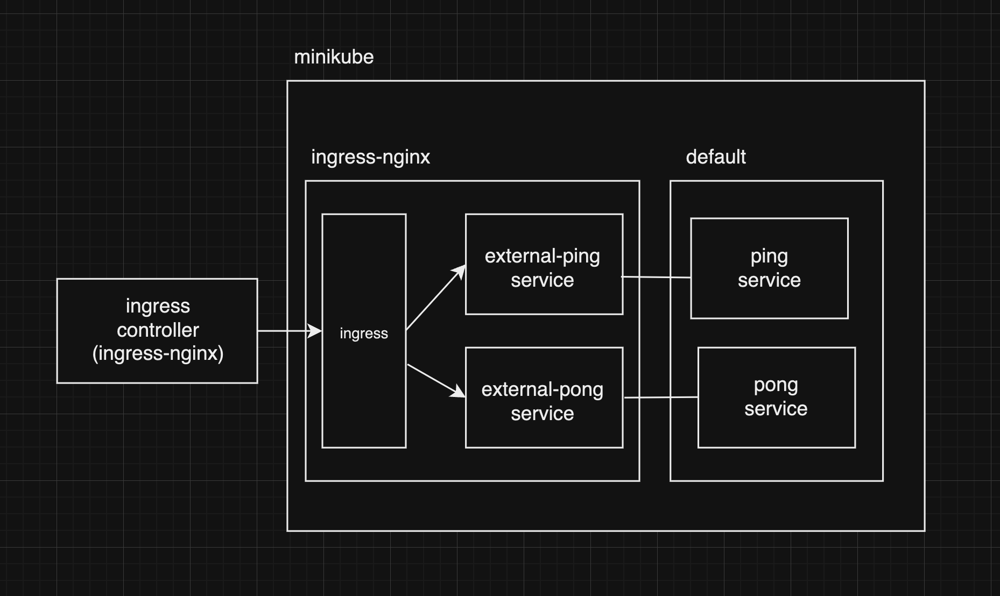
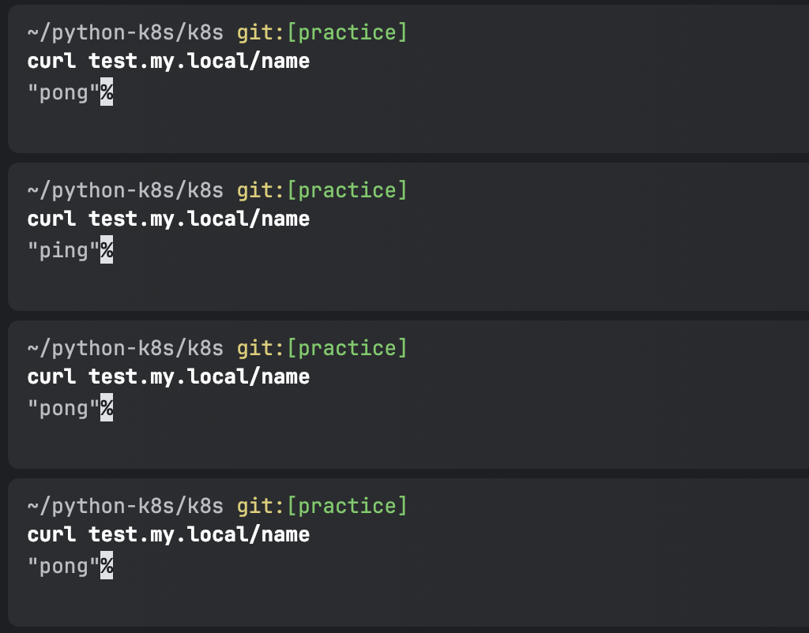

02번에서 이어서 pong 파드를 추가하고 ingress를 통해 접근할 수 있도록 설정한다.

```
apiVersion: v1
kind: Pod
metadata:
  name: pong
  namespace: default
  labels:
    devops.app: pong
spec:
  containers:
    - image: python-test
      imagePullPolicy: IfNotPresent
      name: pong
      ports:
        - containerPort: 8000
          name: pong
          protocol: TCP
      env:
        - name: HOSTNAME
          value: pong
```

```
apiVersion: v1
kind: Service
metadata:
  name: pong
  namespace: default
spec:
  selector:
    devops.app: pong
  ports:
    - protocol: TCP
      port: 8080
      name: ping
      targetPort: pong
      # nodePort: 30002
  # type: NodePort
  type: ClusterIP
---
apiVersion: v1
kind: Service
metadata:
  name: external-pong
  namespace: ingress-nginx
spec:
  type: ExternalName
  externalName: pong.default.svc.cluster.local
```

ping 서비스와 같은 구성으로 서비스를 생성하고, ingress를 통해 접근할 수 있도록 한다.

```
apiVersion: networking.k8s.io/v1
kind: Ingress
metadata:
  name: nginx-ingress
  namespace: ingress-nginx
spec:
  ingressClassName: nginx
  rules:
    - host: test.my.local2
      http:
        paths:
          - path: /
            pathType: Prefix
            backend:
              service:
                name: external-pong
                port:
                  number: 8080
```

이번에는 별도 path rule을 걸지 않고 `/`로만 설정했는데, 이렇게 하면 하위 path로 들어오는 모든 요청을 받아들인다.



구성이 이렇게 되어 `test.my.local`로 접근하면 external-ping으로, `test.my.local2`로 접근하면 external-pong으로 요청이 전달된다.
여기서 몇 가지 상황을 만들어본다.


### 1. ping, pong 모두 중복된 label을 가지는 경우
ping, pong 파드에 실수로 label을 둘 다 `devops.app: ping` 로 설정하면 어떻게 될까?

```
  labels:
    devops.app: ping
```

pong 파드의 label을 바꾼다. 


```
spec:
  selector:
    devops.app: ping
  ports:
    - protocol: TCP
      port: 8080
      name: ping
      targetPort: 8000 # 하드코딩
```
ping 서비스를 targetPort를 alias가 아닌 8000번으로 하드코딩 한 후 변경사항을 반영한다.




그 뒤 curl 요청을 보내면, ping, pong 파드 중 랜덤으로 요청을 보내는 것을 확인할 수 있다.
이렇게 되면 예상치 못한 결과가 나올 수 있으므로, 중복으로 사용하지 않도록 주의해야 한다.


### 2. 존재하지 않는 label을 가지는 경우
이번에는 selector를 잘못된 label을 바라보도록 변경해본다.

```
spec:
  selector:
    devops.app: ping-mistake
```

그 뒤 curl 요청을 보내면, 502 Bad Gateway 에러가 발생한다.

```
$ curl test.my.local/name
<html>
<head><title>502 Bad Gateway</title></head>
<body>
<center><h1>502 Bad Gateway</h1></center>
<hr><center>nginx</center>
</body>
</html>
```
